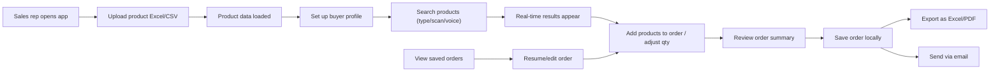

## 1. Product Overview

Tradeshow Order Manager is a web-based tool for sales representatives at trade shows to quickly look up products, build orders on behalf of buyers, and export/email orders for follow-up. The tool eliminates physical catalogs and manual order writing, enabling faster and more accurate sales conversations.

- **Primary user**: Sales representative (always logged in, no authentication needed)
- **Secondary user perspective**: Buyers are set up per-order by the sales rep
- **Core problem**: Slow product lookup and manual order writing at busy trade shows
- **Value proposition**: Instant product search + quick order building + one-click export/email

## 2. Core Features

### 2.1 User Roles
| Role | Registration Method | Core Permissions |
|------|---------------------|------------------|
| Sales Rep | No login required | Upload product data, search products, create buyer profiles, build orders, save & export orders |

Buyers are not users of the system — they are profiles created by the sales rep per order.

### 2.2 Feature Module
1. **Product Search**: Real-time search, barcode scanner, voice input
2. **Product Results**: Product cards with all specs and images
3. **Order / Cart**: Add products to current order, adjust quantities, view order total
4. **Buyer Setup**: Create buyer profile (name, company, email, phone) for the current order
5. **Order Management**: Save orders locally, view order history, resume/edit saved orders
6. **Export & Email**: Export order as Excel/PDF, send order via email
7. **Data Import**: Upload product catalog via Excel/CSV file

### 2.3 Page Details
| Page Name | Module Name | Feature description |
|-----------|-------------|---------------------|
| Home Page | Search Header | Sticky header with search bar, scan button, voice button, upload button, order/cart button with item count badge |
| Home Page | Search Results | Real-time grid of product cards that update as the user types |
| Home Page | Product Card | Displays image, SKU, description, location, dimensions, FOB price, carton qty, notes, and "Add to Order" button with quantity selector |
| Home Page | Empty State | Helpful placeholder when no search query or no results |
| Order Drawer | Buyer Info Panel | Form to enter buyer name, company, email, phone, notes |
| Order Drawer | Cart Items List | Line items with image, SKU, description, quantity adjuster, unit price, line total |
| Order Drawer | Order Summary | Subtotal, item count, carton count, grand total |
| Order Drawer | Action Buttons | Save order, export Excel, export PDF, email order |
| Order History Modal | Saved Orders List | List of saved orders with buyer name, date, total — click to resume |

## 3. Core Process

**Main user flow**: Sales rep opens app → uploads product catalog → sets up buyer info → searches for products (typing/scan/voice) → adds items to the order with desired quantities → reviews order summary → saves order → exports or emails the order.

**About real-time search performance**: Real-time (instant) search is **highly recommended** for this use case and will **not** impact performance negatively for reasonable datasets (up to 10,000+ products). Here's why:
- All data is loaded client-side in memory — no network latency
- Simple string matching on SKU is extremely fast (microseconds per row)
- With debouncing (150ms delay), even fast typists won't cause performance issues
- The UX benefit is enormous: users get instant feedback and can refine searches dynamically
- For very large datasets (100k+ rows), we can add virtualization for the results list

## 4. User Interface Design

### 4.1 Design Style
- **Aesthetic direction**: Industrial / Trade Show Utility — bold, high-contrast, built for speed and readability in bright exhibition halls
- **Primary color**: Deep slate navy (#0f172a) — professional, high-contrast background
- **Accent color**: Electric teal (#06b6d4) — stands out on the show floor, tech-forward feel
- **Secondary accent**: Amber (#f59e0b) — for highlights, price tags, and CTAs
- **Order accent**: Emerald green (#10b981) — for cart/order actions and totals
- **Background**: Subtle grid pattern on dark navy — evokes trade show booth aesthetic
- **Typography**: Display font - Space Grotesk (bold, geometric, industrial feel); Body - Inter (clean, highly readable at all sizes)
- **Buttons**: Sharp-edged with subtle 3D lift effect; solid teal primary, green for order actions, ghost buttons for secondary
- **Cards**: White/light gray product cards with subtle shadow, sharp corners, clean data hierarchy
- **Icon style**: Lucide icons — outlined, clean, consistent weight

### 4.2 Page Design Overview
| Page Name | Module Name | UI Elements |
|-----------|-------------|-------------|
| Home Page | Search Header | Sticky dark navy bar, large teal-accented search input, scan/mic/upload icons, cart button with badge |
| Home Page | Search Results | Responsive grid layout, product cards with "Add to Order" action |
| Home Page | Product Card | Left product image, right column with SKU (bold), description, dimensions badge, price tag, location pill, add-to-order with qty |
| Home Page | Upload Modal | Clean modal with drop zone, file picker, format instructions |
| Order Drawer | Buyer Info | Collapsible panel with name/company/email/phone fields |
| Order Drawer | Cart List | Scrollable list of line items with qty stepper and remove button |
| Order Drawer | Summary | Fixed bottom section with totals and action buttons (Save / Export / Email) |
| Order History | Modal | List of saved orders with date, buyer, total, resume button |

### 4.3 Responsiveness
- **Mobile-first** design (phone and iPad primary use case)
- Large touch targets (min 44x44px) for finger use on the trade show floor
- Results grid: 1 column (mobile), 2 columns (tablet portrait), 3 columns (tablet landscape / desktop)
- Order drawer as bottom sheet on phone, side drawer on tablet/desktop
- Search bar always visible, buttons sized for thumb reach on mobile
- Optimized for both portrait and landscape on iPad

### 4.4 Micro-interactions
- Search results fade/slide in with staggered animation
- Product card lift on hover (translateY + shadow increase)
- Search input focus state with teal glow
- Scan/voice buttons have active pulse animation when recording/listening
- Cart badge bounces when item added
- Order drawer slides smoothly from right
- Quantity stepper has snappy +/- feedback
