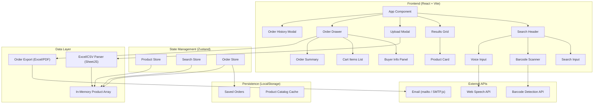
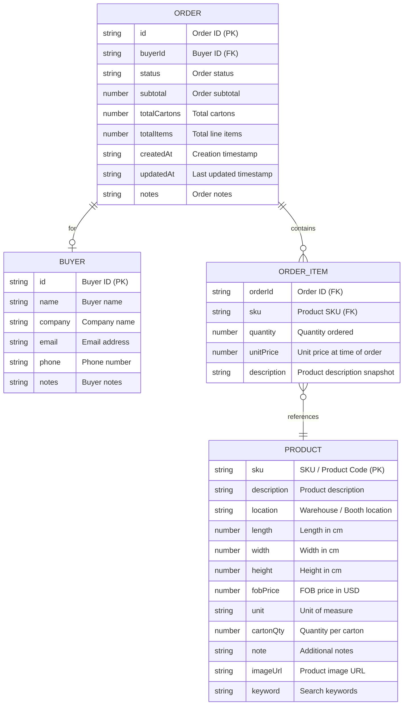

## 1. Architecture Design



## 2. Technology Description

- **Frontend**: React@18 + TypeScript + Vite
- **Styling**: Tailwind CSS@3
- **State Management**: Zustand
- **Excel/CSV Parsing**: SheetJS (xlsx)
- **Excel Export**: SheetJS (xlsx)
- **PDF Export**: jsPDF or html2canvas + jsPDF
- **Icons**: Lucide React
- **Voice Input**: Web Speech API (browser native)
- **Barcode Scanner**: Barcode Detection API + camera fallback
- **Local Persistence**: localStorage (for saved orders and product cache)
- **Email**: mailto: link (primary) + optional SMTP.js fallback
- **Initialization Tool**: vite-init
- **Backend**: None (pure frontend, client-side only)
- **Database**: None (in-memory + localStorage)

**Why no backend?** This is a tradeshow tool that must work reliably with uncertain internet connectivity. All processing happens client-side and data is stored locally in the browser. No server dependency means it works offline.

## 3. Route Definitions

| Route | Purpose |
|-------|---------|
| / | Home page — search + results + order drawer |

Single-page application. All functionality on one page for maximum speed during trade shows.

## 4. Data Model

### 4.1 Entity Relationship Diagram



### 4.2 TypeScript Interfaces

```typescript
interface Product {
  sku: string;
  description: string;
  location: string;
  length: number;
  width: number;
  height: number;
  fobPrice: number;
  unit: string;
  cartonQty: number;
  note: string;
  imageUrl: string;
  keyword: string;
}

interface Buyer {
  id: string;
  name: string;
  company: string;
  email: string;
  phone: string;
  notes: string;
}

interface OrderItem {
  sku: string;
  description: string;
  quantity: number;
  unitPrice: number;
  imageUrl: string;
}

interface Order {
  id: string;
  buyer: Buyer | null;
  items: OrderItem[];
  status: 'draft' | 'saved' | 'sent';
  subtotal: number;
  totalItems: number;
  totalCartons: number;
  createdAt: string;
  updatedAt: string;
  notes: string;
}

interface ProductStore {
  products: Product[];
  isLoaded: boolean;
  loadProducts: (products: Product[]) => void;
  clearProducts: () => void;
  getProductBySku: (sku: string) => Product | undefined;
}

interface SearchStore {
  query: string;
  results: Product[];
  setQuery: (query: string) => void;
}

interface OrderStore {
  currentOrder: Order;
  savedOrders: Order[];
  isDrawerOpen: boolean;
  addItem: (product: Product, qty?: number) => void;
  removeItem: (sku: string) => void;
  updateQuantity: (sku: string, qty: number) => void;
  setBuyer: (buyer: Buyer) => void;
  saveOrder: () => void;
  loadOrder: (id: string) => void;
  deleteOrder: (id: string) => void;
  newOrder: () => void;
  toggleDrawer: () => void;
}
```

### 4.3 Excel Column Mapping

| Excel Column | Property | Format |
|--------------|----------|--------|
| SKU | sku | string |
| Description | description | string |
| Location | location | string |
| L | length | number (cm) |
| W | width | number (cm) |
| H | height | number (cm) |
| FOB | fobPrice | number (USD) |
| Unit | unit | string |
| Carton Qty | cartonQty | number |
| Note | note | string |
| IMG | imageUrl | string (URL) |
| Keyword | keyword | string |

## 5. Project Structure

```
Tradeshow App/
├── src/
│   ├── components/
│   │   ├── SearchHeader.tsx      # Sticky search bar with scan/voice/upload/cart
│   │   ├── SearchInput.tsx       # Search input component
│   │   ├── ResultsGrid.tsx       # Product results grid
│   │   ├── ProductCard.tsx       # Individual product card
│   │   ├── UploadModal.tsx       # File upload modal
│   │   ├── EmptyState.tsx        # Empty / no results state
│   │   ├── OrderDrawer.tsx       # Order / cart side drawer
│   │   ├── BuyerInfoForm.tsx     # Buyer profile form
│   │   ├── CartItem.tsx          # Single cart line item
│   │   ├── OrderSummary.tsx      # Order totals + action buttons
│   │   └── OrderHistoryModal.tsx # Saved orders list
│   ├── hooks/
│   │   ├── useVoiceSearch.ts     # Web Speech API hook
│   │   ├── useBarcodeScan.ts     # Barcode detection hook
│   │   └── useDebounce.ts        # Debounce hook
│   ├── store/
│   │   ├── useProductStore.ts    # Zustand product store
│   │   ├── useSearchStore.ts     # Zustand search store
│   │   └── useOrderStore.ts      # Zustand order store
│   ├── utils/
│   │   ├── excelParser.ts        # Excel/CSV parsing
│   │   ├── orderExport.ts        # Excel/PDF export
│   │   ├── formatters.ts         # Data formatting helpers
│   │   └── storage.ts            # LocalStorage utilities
│   ├── types/
│   │   ├── product.ts            # Product type definitions
│   │   ├── buyer.ts              # Buyer type definitions
│   │   └── order.ts              # Order type definitions
│   ├── App.tsx                   # Main app component
│   ├── main.tsx                  # Entry point
│   └── index.css                 # Global styles + Tailwind
├── sample import.xlsx            # Sample product data
├── package.json
├── vite.config.ts
├── tailwind.config.js
├── tsconfig.json
└── index.html
```

## 6. Key Implementation Notes

### Search Performance
- Client-side in-memory filtering with `Array.filter()`
- Debounced search (150ms) to prevent excessive re-renders
- Search matches on SKU, description, keyword, and location — case-insensitive
- Fuzzy substring matching, not exact match

### File Upload & Data Handling
- Drag-and-drop + click-to-upload
- Supports .xlsx, .xls, and .csv formats
- Parsed in-browser using SheetJS
- First row as header, auto-detect column mapping
- Sample file included as default/demo data on first load
- `#N/A` values treated as blank/empty strings
- Mobile-first responsive design (phone and iPad primary)

### Order Persistence
- Saved orders stored in localStorage
- Product catalog optionally cached in localStorage
- Order history preserved across browser sessions

### Export & Email
- Excel export using SheetJS (same library as import)
- PDF export using html2canvas + jsPDF (client-side generation)
- Email via `mailto:` link with order details in body
- Optional: SMTP.js for direct email sending (requires SMTP config)

### Browser Compatibility
- Voice: Web Speech API (Chrome/Edge/Safari)
- Barcode: Barcode Detection API with camera fallback
- All data stays in browser — works fully offline once loaded
